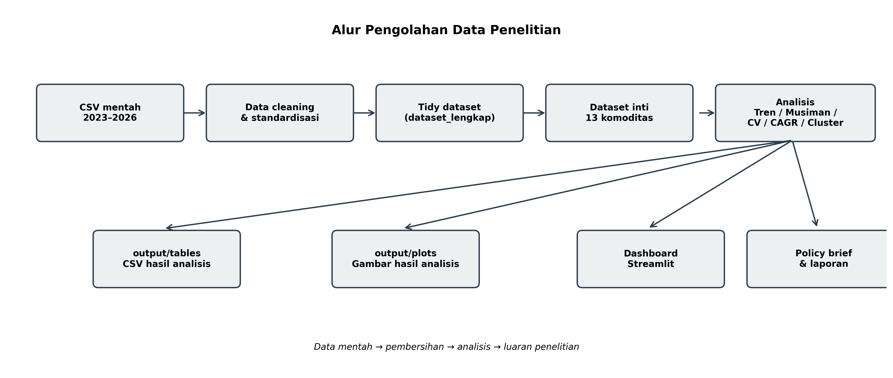
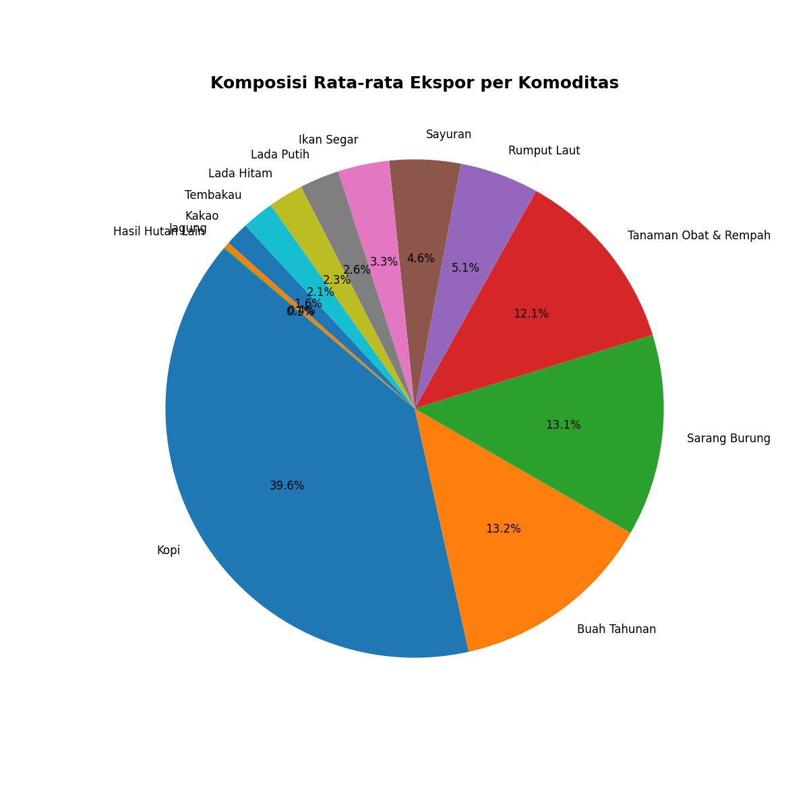
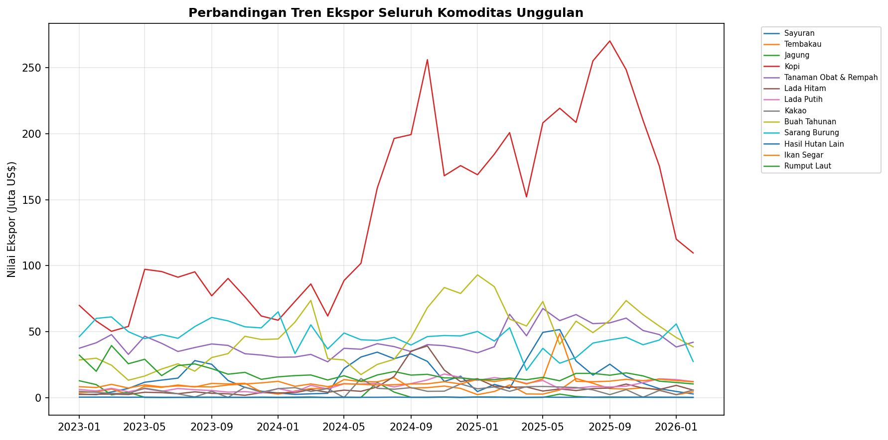
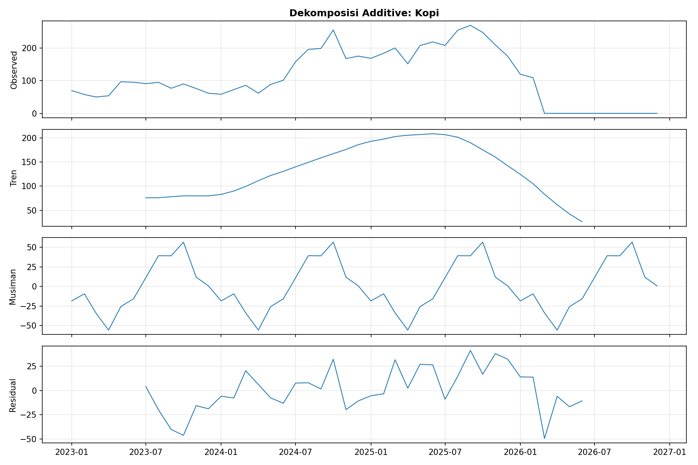
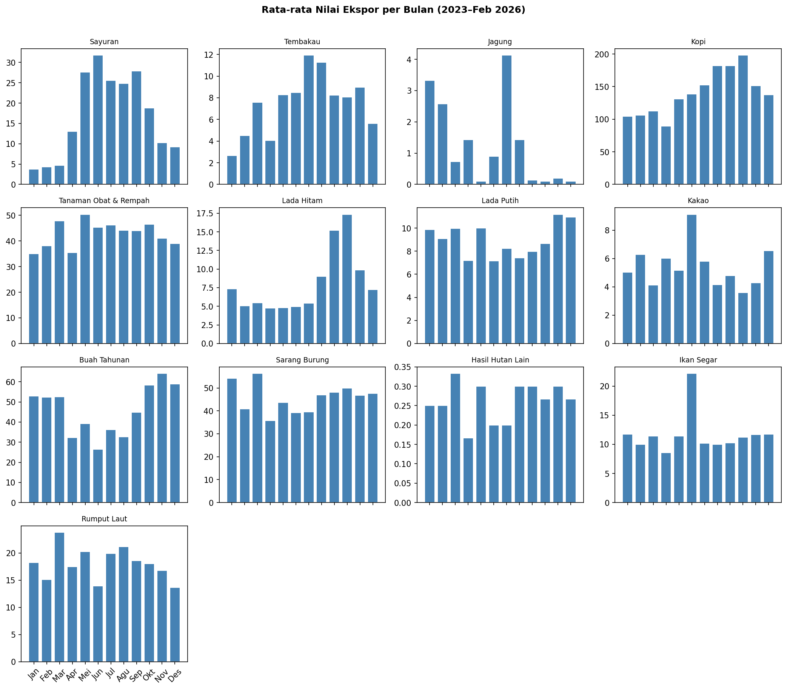
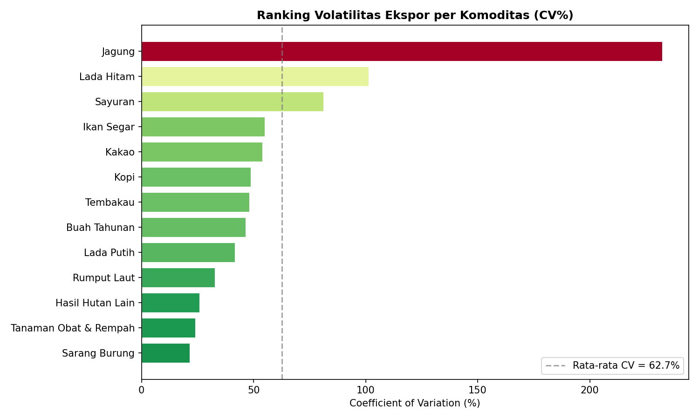
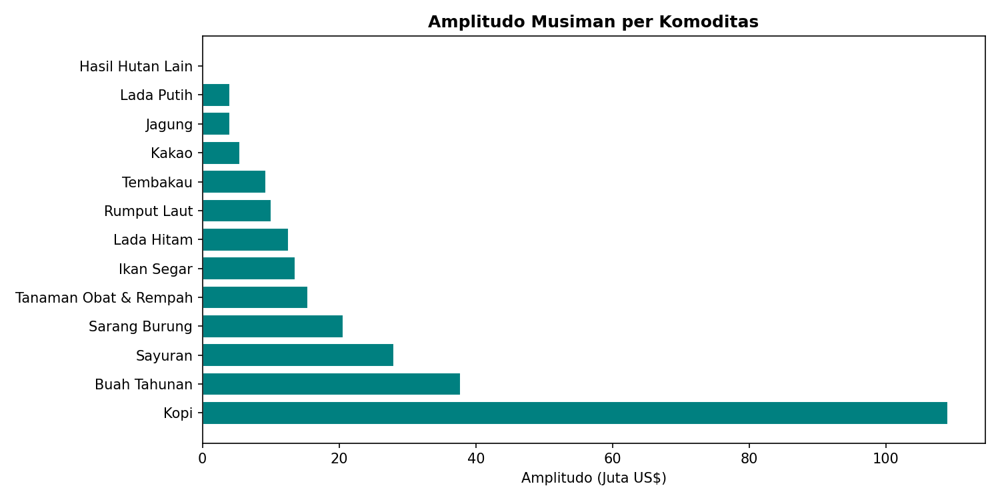
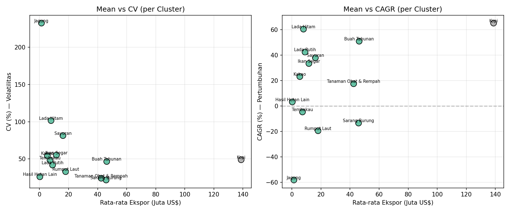
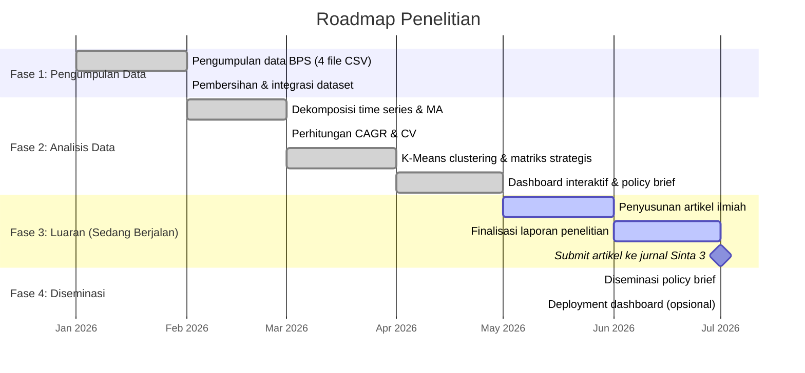

# HASIL PELAKSANAAN PENELITIAN

Hasil pelaksanaan penelitian pada tahun berjalan telah berlangsung sesuai dengan tahapan yang direncanakan dalam proposal, mencakup pengumpulan data, pengolahan dataset, analisis tren dan pola musiman, pengukuran volatilitas, serta segmentasi komoditas. Penelitian ini menggunakan data sekunder bulanan nilai ekspor 13 komoditas pertanian unggulan Indonesia selama 38 bulan, yaitu periode Januari 2023 – Februari 2026, yang bersumber dari Badan Pusat Statistik (BPS). Seluruh analisis dilakukan secara kuantitatif-deskriptif berbasis *time series* dengan pendekatan *moving average*, dekomposisi *time series*, *compound annual growth rate* (CAGR), *coefficient of variation* (CV), dan *K-Means clustering*.

---

## A. Data BPS dan Integrasi Dataset

Data ekspor bulanan dari Badan Pusat Statistik (BPS) telah dikumpulkan untuk 13 komoditas pertanian unggulan Indonesia selama periode Januari 2023 – Februari 2026. Dataset awal berasal dari empat berkas CSV tahunan, yang kemudian dibersihkan dan diintegrasikan ke dalam satu dataset analitik yang konsisten.

Tahap ini mencakup:
1. Penyeragaman format data
2. Transformasi dari format lebar (*wide*) ke format panjang (*tidy*)
3. Pemilahan komoditas inti dari data agregat
4. Validasi data bulanan per komoditas

Hasil pengolahan menghasilkan **494 observasi inti**, yang merepresentasikan kombinasi 13 komoditas dan 38 bulan observasi dengan nilai valid.

**Tabel 1. Ringkasan Dataset Penelitian**

| Komponen | Nilai |
|---|---|
| Jumlah file CSV | 4 |
| Periode | Januari 2023 – Februari 2026 |
| Jumlah komoditas | 13 |
| Jumlah observasi inti | 494 |
| Sumber data | Badan Pusat Statistik (BPS) |

Tiga belas komoditas yang dianalisis meliputi: Sayur-sayuran, Tembakau, Jagung, Kopi, Tanaman Obat dan Rempah-Rempah, Lada Hitam, Lada Putih, Biji Kakao, Buah-buahan Tahunan, Sarang Burung, Hasil Hutan Bukan Kayu Lainnya, Ikan Segar dan Dingin Hasil Tangkapan, serta Rumput Laut dan Ganggang Lainnya.

**Gambar 1. Alur Pengolahan Data Penelitian**

**Gambar 2. Sebaran Rata-rata Nilai Ekspor per Komoditas**

Tahapan ini sejalan dengan rencana kerja penelitian pada fase awal, yaitu pengumpulan dan pra-pemrosesan data. Penggunaan data BPS sebagai sumber utama juga konsisten dengan praktik penelitian perdagangan komoditas di Indonesia yang menempatkan data ekspor resmi sebagai basis analisis kinerja sektor pertanian.

---

## B. Data Cleaning, Preprocessing, dan Penyesuaian Format

Setelah data BPS terkumpul, dilakukan *data cleaning* dan *preprocessing* untuk memastikan data siap dianalisis secara deret waktu. Proses ini meliputi penyesuaian format variabel, normalisasi nama komoditas, serta penanganan data bulanan yang belum lengkap pada tahun 2026 karena observasi baru tersedia hingga Februari 2026.

Tahap ini penting untuk menjaga konsistensi struktur data, menghindari duplikasi pembacaan berkas, serta memastikan seluruh komoditas memiliki dimensi waktu yang seragam. Hasil akhirnya adalah dataset *tidy* yang siap digunakan untuk analisis lanjutan, baik secara statistik deskriptif maupun visualisasi interaktif.

Pada tahap ini, data juga disiapkan untuk analisis cabang (*branch analysis*) berikutnya, yaitu:
1. Dekomposisi *time series* untuk identifikasi tren dan pola musiman
2. Penghitungan CAGR untuk pertumbuhan relatif
3. Pengukuran CV untuk volatilitas relatif
4. Segmentasi komoditas melalui *K-Means clustering*

---

## C. Dekomposisi Time Series dan Analisis Tren

Analisis tren dilakukan dengan pendekatan *moving average* MA-3 dan MA-6 untuk meredam fluktuasi jangka pendek nilai ekspor. Dekomposisi *time series* juga dilakukan untuk memisahkan komponen tren, musiman, dan residual sehingga pola pergerakan tiap komoditas dapat diamati secara lebih jelas. Hasil analisis menunjukkan variasi kinerja antarkomoditas yang cukup tajam.

**Gambar 3. Tren Nilai Ekspor Bulanan — Seluruh Komoditas (Overlay)**

**Gambar 4. Hasil Dekomposisi Time Series — Kopi (Model Aditif)**

**Gambar 5. Pola Musiman — Seasonal Subseries Plot**

Komoditas dengan pertumbuhan paling kuat selama periode pengamatan adalah:
- **Kopi**, CAGR **65,21%**
- **Lada Hitam**, CAGR **60,47%**
- **Buah-buahan Tahunan**, CAGR **50,96%**

Sebaliknya, komoditas dengan kontraksi terbesar adalah:
- **Jagung**, CAGR **-58,28%**
- **Rumput Laut dan Ganggang Lainnya**, CAGR **-19,51%**
- **Sarang Burung**, CAGR **-13,46%**

**Tabel 2. Ringkasan CAGR 2023–2025**

| Komoditas | Total 2023 (Juta US$) | Total 2025 (Juta US$) | CAGR (%) |
|---|---|---|---|
| Kopi | 916,6 | 2.501,9 | 65,21 |
| Lada Hitam | 36,0 | 92,7 | 60,47 |
| Buah-buahan Tahunan | 333,4 | 759,8 | 50,96 |
| Lada Putih | 63,9 | 129,6 | 42,41 |
| Sayur-sayuran | 134,0 | 254,9 | 37,92 |
| Ikan Segar/Dingin Hasil Tangkapan | 106,7 | 189,9 | 33,41 |
| Biji Kakao | 46,9 | 71,1 | 23,13 |
| Tanaman Obat, Aromatik, dan Rempah-Rempah | 465,2 | 642,3 | 17,50 |
| Hasil Hutan Bukan Kayu Lainnya | 3,1 | 3,3 | 3,18 |
| Tembakau | 86,8 | 78,8 | -4,72 |
| Sarang Burung | 633,4 | 474,4 | -13,46 |
| Rumput Laut dan Ganggang Lainnya | 284,8 | 184,5 | -19,51 |
| Jagung | 29,3 | 5,1 | -58,28 |

Temuan ini menunjukkan bahwa ekspor komoditas pertanian Indonesia tidak bergerak seragam, melainkan dipengaruhi oleh karakteristik produksi, dinamika pasar internasional, dan pola permintaan yang berbeda-beda pada tiap komoditas. Kopi mendominasi pertumbuhan dengan kenaikan dari 916,6 juta US$ (2023) menjadi 2.501,9 juta US$ (2025). Di sisi lain, Jagung mengalami penurunan drastis dari 29,3 juta US$ menjadi hanya 5,1 juta US$.

---

## D. Analisis CAGR, CV, dan K-Means Clustering

Setelah pola tren dan musiman diperoleh, penelitian bercabang menjadi tiga analisis lanjutan, yaitu CAGR, CV, dan *K-Means clustering*. Ketiga hasil ini digunakan sebagai dasar integrasi matriks fitur untuk menyusun segmentasi komoditas.

### 1. CAGR sebagai Ukuran Pertumbuhan Geometrik Rata-rata

CAGR digunakan untuk mengukur pertumbuhan relatif antarkomoditas selama periode 2023–2025. Indikator ini efektif untuk menunjukkan komoditas dengan kinerja ekspor yang tumbuh cepat secara konsisten.

Hasil analisis menunjukkan bahwa komoditas dengan pertumbuhan paling kuat adalah:
- Kopi (**65,21%**)
- Lada Hitam (**60,47%**)
- Buah-buahan Tahunan (**50,96%**)

**Gambar 6. Hasil CAGR per Komoditas**

> *Screenshot dari Dashboard — Tab Perbandingan → pilih metrik CAGR (%)*

### 2. CV sebagai Ukuran Volatilitas Relatif Bebas Skala

CV digunakan untuk mengukur tingkat volatilitas ekspor tanpa dipengaruhi oleh besar kecilnya skala ekspor. Komoditas dengan CV rendah menunjukkan kestabilan yang lebih baik, sedangkan CV tinggi menunjukkan fluktuasi yang tajam.

**Tabel 3. Ranking Volatilitas (CV) dan Statistik Deskriptif**

| Komoditas | Rata-rata (Juta US$) | Std | CV (%) | Min | Max |
|---|---|---|---|---|---|
| Sarang Burung | 45,85 | 9,97 | **21,74** | 20,6 | 65,0 |
| Tanaman Obat, Aromatik, dan Rempah-Rempah | 42,46 | 10,25 | **24,13** | 27,1 | 67,5 |
| Hasil Hutan Bukan Kayu Lainnya | 0,26 | 0,07 | **26,08** | 0,1 | 0,4 |
| Rumput Laut dan Ganggang Lainnya | 17,99 | 5,93 | **32,97** | 10,3 | 39,4 |
| Lada Putih | 9,01 | 3,77 | **41,80** | 3,4 | 17,8 |
| Buah-buahan Tahunan | 46,26 | 21,56 | **46,61** | 13,1 | 93,0 |
| Tembakau | 7,27 | 3,51 | **48,22** | 2,1 | 15,0 |
| Kopi | 138,75 | 67,89 | **48,93** | 50,2 | 270,3 |
| Biji Kakao | 5,43 | 2,95 | **54,23** | 0,0 | 14,4 |
| Ikan Segar/Dingin Hasil Tangkapan | 11,67 | 6,45 | **55,24** | 7,2 | 48,5 |
| Sayur-sayuran | 16,14 | 13,13 | **81,36** | 2,2 | 51,5 |
| Lada Hitam | 7,95 | 8,07 | **101,53** | 1,7 | 39,1 |
| Jagung | 1,35 | 3,14 | **232,46** | 0,0 | 12,7 |

Komoditas paling stabil adalah:
- **Sarang Burung** (**21,74%**)
- **Tanaman Obat, Aromatik, dan Rempah-Rempah** (**24,13%**)

Komoditas paling volatil adalah:
- **Jagung** (**232,46%**)
- **Lada Hitam** (**101,53%**)

**Gambar 7. Ranking Volatilitas per Komoditas (CV%)**

**Gambar 8. Amplitudo Musiman per Komoditas**

**Tabel 4. Amplitudo Musiman per Komoditas**

| Komoditas | Puncak | Nilai Puncak | Lembah | Nilai Lembah | Amplitudo | Rasio P/L |
|---|---|---|---|---|---|---|
| Kopi | Oktober | 198,30 | April | 89,27 | 109,03 | 2,22 |
| Buah-buahan Tahunan | November | 64,20 | Juni | 26,43 | 37,77 | 2,43 |
| Sayur-sayuran | Juni | 31,80 | Januari | 3,78 | 28,02 | 8,42 |
| Sarang Burung | Maret | 56,37 | April | 35,77 | 20,60 | 1,58 |
| Tanaman Obat, Aromatik, dan Rempah-Rempah | Mei | 50,43 | Januari | 35,02 | 15,41 | 1,44 |
| Ikan Segar/Dingin Hasil Tangkapan | Juni | 22,20 | April | 8,60 | 13,60 | 2,58 |
| Lada Hitam | Oktober | 17,37 | April | 4,77 | 12,60 | 3,64 |
| Rumput Laut dan Ganggang Lainnya | Maret | 23,77 | Desember | 13,67 | 10,10 | 1,74 |
| Tembakau | Juli | 11,93 | Januari | 2,65 | 9,28 | 4,50 |
| Biji Kakao | Juni | 9,13 | Oktober | 3,60 | 5,53 | 2,54 |
| Jagung | Juli | 4,13 | Mei | 0,10 | 4,03 | 41,33 |
| Lada Putih | November | 11,20 | Juni | 7,17 | 4,03 | 1,56 |
| Hasil Hutan Bukan Kayu Lainnya | Maret | 0,33 | April | 0,17 | 0,17 | 2,00 |

### 3. K-Means Clustering untuk Segmentasi Komoditas

*K-Means clustering* dilakukan untuk mengelompokkan komoditas berdasarkan karakteristik pertumbuhan, volatilitas, skala ekspor, amplitudo musiman, dan *slope* tren. Evaluasi *silhouette score* menunjukkan bahwa **k = 2** merupakan konfigurasi terbaik. Hasil ini mengelompokkan Kopi (Cluster 1) sebagai komoditas dengan skala ekspor paling dominan (mean 138,75 juta US$), terpisah dari 12 komoditas lainnya (Cluster 0).

**Gambar 9. Hasil K-Means Clustering Komoditas**

**Tabel 5. Hasil Segmentasi K-Means Clustering**

| Komoditas | Cluster | Mean (Juta US$) | CV (%) | CAGR (%) | Amplitudo (Juta US$) |
|---|---|---|---|---|---|
| Sayur-sayuran | 0 | 16,14 | 81,36 | 37,92 | 28,02 |
| Tembakau | 0 | 7,27 | 48,22 | -4,72 | 9,28 |
| Jagung | 0 | 1,35 | 232,46 | -58,28 | 4,03 |
| **Kopi** | **1** | **138,75** | **48,93** | **65,21** | **109,03** |
| Tanaman Obat, Aromatik, dan Rempah-Rempah | 0 | 42,46 | 24,13 | 17,50 | 15,41 |
| Lada Hitam | 0 | 7,95 | 101,53 | 60,47 | 12,60 |
| Lada Putih | 0 | 9,01 | 41,80 | 42,41 | 4,03 |
| Biji Kakao | 0 | 5,43 | 54,23 | 23,13 | 5,53 |
| Buah-buahan Tahunan | 0 | 46,26 | 46,61 | 50,96 | 37,77 |
| Sarang Burung | 0 | 45,85 | 21,74 | -13,46 | 20,60 |
| Hasil Hutan Bukan Kayu Lainnya | 0 | 0,26 | 26,08 | 3,18 | 0,17 |
| Ikan Segar/Dingin Hasil Tangkapan | 0 | 11,67 | 55,24 | 33,41 | 13,60 |
| Rumput Laut dan Ganggang Lainnya | 0 | 17,99 | 32,97 | -19,51 | 10,10 |

---

## E. Integrasi Matriks Fitur CAGR, CV, dan Rata-rata Ekspor

Untuk menjawab kebutuhan perumusan strategi pengelolaan risiko ekspor, hasil analisis CAGR, CV, dan rata-rata nilai ekspor diintegrasikan ke dalam **Matriks Strategis**. Matriks ini mengelompokkan komoditas ke dalam empat kuadran:

| Kuadran | Kriteria | Komoditas | Implikasi |
|---|---|---|---|
| **⭐ Andalan** | CAGR tinggi, CV rendah | Lada Putih, Buah-buahan Tahunan | Pertumbuhan kuat dan relatif stabil |
| **📈 Potensial** | CAGR tinggi, CV tinggi | Kopi, Lada Hitam, Sayur-sayuran, Biji Kakao, Ikan Segar | Tumbuh cepat, namun perlu mitigasi risiko |
| **🟢 Stabil** | CAGR rendah, CV rendah | Sarang Burung, Tanaman Obat dan Rempah-Rempah, Tembakau, Rumput Laut, Hasil Hutan Bukan Kayu | Risiko rendah, pertumbuhan relatif stagnan/negatif |
| **⚠️ Risiko Tinggi** | CAGR rendah, CV tinggi | Jagung | Memerlukan perhatian kebijakan dan stabilisasi |

**Gambar 10. Pemetaan Strategis Komoditas Ekspor (Bubble Chart CAGR × CV × Mean)**

> *Screenshot dari Dashboard — Tab Matriks Strategis → Bubble Chart*

**Tabel 6. Rangkuman Matriks Strategis Komoditas**

| Komoditas | Kuadran | Mean (Juta US$) | CV (%) | CAGR (%) | Amplitudo Musiman |
|---|---|---|---|---|---|
| Lada Putih | ⭐ Andalan | 9,01 | 41,80 | 42,41 | 4,03 |
| Buah-buahan Tahunan | ⭐ Andalan | 46,26 | 46,61 | 50,96 | 37,77 |
| Kopi | 📈 Potensial | 138,75 | 48,93 | 65,21 | 109,03 |
| Lada Hitam | 📈 Potensial | 7,95 | 101,53 | 60,47 | 12,60 |
| Sayur-sayuran | 📈 Potensial | 16,14 | 81,36 | 37,92 | 28,02 |
| Biji Kakao | 📈 Potensial | 5,43 | 54,23 | 23,13 | 5,53 |
| Ikan Segar/Dingin Hasil Tangkapan | 📈 Potensial | 11,67 | 55,24 | 33,41 | 13,60 |
| Sarang Burung | 🟢 Stabil | 45,85 | 21,74 | -13,46 | 20,60 |
| Tanaman Obat, Aromatik, dan Rempah-Rempah | 🟢 Stabil | 42,46 | 24,13 | 17,50 | 15,41 |
| Tembakau | 🟢 Stabil | 7,27 | 48,22 | -4,72 | 9,28 |
| Rumput Laut dan Ganggang Lainnya | 🟢 Stabil | 17,99 | 32,97 | -19,51 | 10,10 |
| Hasil Hutan Bukan Kayu Lainnya | 🟢 Stabil | 0,26 | 26,08 | 3,18 | 0,17 |
| Jagung | ⚠️ Risiko Tinggi | 1,35 | 232,46 | -58,28 | 4,03 |

Segmentasi ini menjadi dasar ilmiah dalam menyusun rekomendasi pengelolaan risiko ekspor, khususnya untuk menentukan komoditas prioritas, komoditas stabil, dan komoditas yang membutuhkan intervensi kebijakan.

---

## F. Pengembangan Luaran

Pengembangan luaran penelitian dilakukan secara paralel dengan analisis data agar hasil penelitian dapat langsung dimanfaatkan untuk diseminasi dan pengambilan keputusan.

### 1. Dashboard Interaktif

Dashboard interaktif berbasis web telah selesai dibangun menggunakan **Streamlit** dan **Plotly** untuk menampilkan visualisasi tren, pola musiman, segmentasi, serta matriks strategis komoditas. Dashboard ini memungkinkan pengguna memilih komoditas, membandingkan indikator, serta menelusuri pola ekspor secara interaktif melalui lima tab utama: Tren Ekspor, Perbandingan, Analisis Lanjutan, Matriks Strategis, dan Tabel Data.

**Gambar 11. Tampilan Dashboard Interaktif**

> *Jalankan `streamlit run scripts/06_dashboard.py` untuk melihat dashboard*

### 2. Policy Brief dan Rekomendasi Strategis

Hasil matriks strategis digunakan sebagai dasar penyusunan *policy brief* yang memuat rekomendasi pengelolaan risiko ekspor bagi pemangku kebijakan dan pelaku usaha. Rekomendasi diarahkan pada penguatan komoditas andalan, stabilisasi komoditas potensial, efisiensi komoditas stabil, serta evaluasi kebijakan pada komoditas berisiko tinggi.

### 3. Laporan dan Artikel Ilmiah

Naskah laporan penelitian sedang dirampungkan berdasarkan hasil analisis dan visualisasi yang telah dihasilkan. Hasil yang sama juga menjadi bahan utama penyusunan artikel ilmiah untuk jurnal terakreditasi Sinta 3.

---

## G. Capaian Luaran Penelitian

| Jenis Luaran | Identitas Luaran | Status Ketercapaian | Bukti Kemajuan |
|---|---|---|---|
| **Luaran Wajib** | | | |
| Publikasi ilmiah | Artikel jurnal Sinta 3 — "Analisis Tren dan Pola Musiman Ekspor Komoditas Pertanian Unggulan Indonesia" | **Sedang disusun** | Naskah disiapkan berdasarkan hasil analisis tren, dekomposisi musiman, CAGR, CV, dan segmentasi komoditas. Seluruh data pendukung tersedia. |
| Laporan penelitian | Laporan komprehensif sesuai format laporan kemajuan/akhir | **Sedang disusun** | Draft hasil pelaksanaan telah selesai. Memuat ringkasan data, analisis, matriks strategis, dan rencana tahap selanjutnya. |
| **Luaran Tambahan** | | | |
| Dashboard interaktif | Dashboard web Streamlit + Plotly | **Selesai** | Script `scripts/06_dashboard.py` — 5 tab: Tren, Perbandingan, Analisis, Matriks Strategis, Tabel Data. |
| Policy brief | Dokumen rekomendasi strategis pengelolaan risiko ekspor | **Selesai** | File `output/policy_brief.md` — rekomendasi untuk pemangku kebijakan dan pelaku ekspor. |
| Matriks strategis | Analisis CAGR × CV × Mean — 4 kuadran | **Selesai** | Tabel `output/tables/matriks_strategis.csv` dan visualisasi `output/plots/matriks_strategis.html`. |

---

## H. Kendala Pelaksanaan Penelitian

Selama pelaksanaan penelitian, beberapa kendala teknis-operasional dihadapi dan berhasil diatasi sebagai berikut:

| No | Kendala | Detail | Dampak | Solusi |
|---|---|---|---|---|
| 1 | **Ketersediaan data awal** | Data BPS tahun 2023 belum terkonsolidasi di folder kerja lokal. Empat file CSV tahunan tersimpan terpisah tanpa struktur seragam. | Waktu tambahan untuk standardisasi kolom. | Script `01_pembersihan.py` otomatis menggabungkan dan menyeragamkan format seluruh CSV tahunan. |
| 2 | **Data 2026 tidak lengkap** | Observasi BPS hanya tersedia hingga Februari 2026 (2 bulan). | Analisis musiman 2026 belum dapat disajikan penuh. | Indeks musiman dihitung menggunakan data penuh 2023–2025 dengan metode *seasonal index rolling*. |
| 3 | **Ekspor Plotly ke format statis** | Engine Kaleido untuk ekspor PNG gagal instalasi di lingkungan Windows. | Visualisasi interaktif tidak bisa diekspor otomatis ke PNG. | Visualisasi disimpan dalam format HTML mandiri (`*.html`) agar tetap interaktif tanpa dependensi tambahan. |
| 4 | **Nilai nol pada beberapa komoditas** | Jagung dan Kopi (bulan awal) memiliki nilai ekspor 0,0. Dekomposisi multiplicative gagal pada nilai nol. | Error pada dekomposisi multiplicative. | Penerapan penggantian sementara (0 → 0,001) khusus untuk dekomposisi multiplicative. |
| 5 | **Periode observasi pendek** | 38 bulan hanya mencakup ~3 siklus musiman, idealnya ≥4–5 siklus (48–60 bulan). | Komponen musiman belum menangkap pola siklus jangka panjang penuh. | Interpretasi difokuskan pada komoditas dengan siklus jelas (Kopi, Sayuran, Buah Tahunan). |
| 6 | **Dashboard belum di-deploy** | Dashboard Streamlit hanya berjalan lokal, belum ke server publik. | Tidak dapat diakses pemangku kebijakan secara langsung. | Script dan data terdokumentasi di README. Deployment direncanakan pada tahap diseminasi. |
| 7 | **Segmentasi K-Means terbatas** | Silhouette score optimal di k=2, hanya memisahkan Kopi dari 12 komoditas lain. | Segmentasi kurang granular untuk kebijakan. | Matriks Strategis 4 kuadran digunakan sebagai pendekatan komplementer yang lebih aplikatif. |

**Ringkasan:** Seluruh kendala telah dapat diatasi dengan penyesuaian teknis pada script analisis. Tidak ada luaran yang gagal dicapai — dashboard, *policy brief*, dan matriks strategis selesai 100%. Artikel ilmiah dan laporan final masih dalam penyusunan sesuai jadwal yang direncanakan.

---

## I. Rencana Tahapan Selanjutnya

Berdasarkan capaian saat ini, rencana tahapan penelitian selanjutnya difokuskan pada penyelesaian luaran wajib dan diseminasi hasil:

### 1. Penyelesaian Artikel Ilmiah (Bulan ke-5)

| Kegiatan | Target Waktu | Detail |
|---|---|---|
| Finalisasi naskah artikel | Minggu 1–2 | Menyusun pendahuluan, metodologi, hasil, dan pembahasan berdasarkan data dan visualisasi yang telah dihasilkan |
| *Proofreading* dan revisi | Minggu 3 | Pemeriksaan tata bahasa, konsistensi istilah, dan format sitasi |
| Submit ke jurnal Sinta 3 | Minggu 4 | Target jurnal: Jurnal Ekonomi Pertanian atau Agribisnis terakreditasi Sinta 3 yang relevan |

Naskah artikel akan mencakup:
- Analisis tren dan dekomposisi musiman 13 komoditas (periode 2023–2026)
- Perbandingan pertumbuhan (CAGR) dan volatilitas (CV)
- Segmentasi komoditas melalui K-Means dan Matriks Strategis

### 2. Penyelesaian Laporan Akhir (Bulan ke-6)

| Kegiatan | Target Waktu | Detail |
|---|---|---|
| Integrasi seluruh tabel dan gambar | Minggu 1–2 | Menyisipkan tabel dari `output/tables/` dan gambar dari `output/plots/` ke dalam dokumen laporan akhir |
| Penulisan bab pembahasan | Minggu 2–3 | Menginterpretasikan temuan statistik dalam konteks kebijakan perdagangan komoditas pertanian |
| Finalisasi dan pengesahan | Minggu 4 | Penyusunan daftar pustaka, lampiran, dan penyerahan ke STIESIA Surabaya |

Laporan akhir akan mengintegrasikan:
- 9 tabel hasil analisis dari `output/tables/`
- 30+ visualisasi dari `output/plots/`
- Matriks strategis dan rekomendasi kebijakan

### 3. Diseminasi Policy Brief (Bulan ke-6)

| Kegiatan | Target Waktu | Detail |
|---|---|---|
| Distribusi ke pemangku kepentingan | Minggu 2–4 | Mengirimkan *policy brief* kepada asosiasi eksportir komoditas pertanian dan dinas perdagangan daerah terkait |
| Deployment dashboard publik (opsional) | Minggu 3–4 | Deployment dashboard ke Streamlit Cloud atau server institusi agar dapat diakses publik |

### 4. Roadmap Penelitian Keseluruhan

### Ringkasan Rencana

| No | Kegiatan | Target Waktu | Status |
|---|---|---|---|
| 1 | Submit artikel ilmiah ke jurnal Sinta 3 | Bulan ke-5 (Juli 2026) | Naskah sedang disusun |
| 2 | Finalisasi laporan penelitian komprehensif | Bulan ke-6 (Juli 2026) | Draft telah tersedia |
| 3 | Diseminasi *policy brief* ke pemangku kepentingan | Bulan ke-6 (Juli 2026) | Dokumen siap distribusi |
| 4 | Deployment dashboard publik (opsional) | Bulan ke-6 (Juli 2026) | Menunggu keputusan institusi |

Seluruh luaran tambahan (dashboard interaktif, *policy brief*, dan matriks strategis) telah selesai 100%. Fokus akhir penelitian adalah penyelesaian luaran wajib berupa artikel ilmiah Sinta 3 dan laporan akhir.

---

## Referensi Acuan (2021–2026)

1. Badan Pusat Statistik. (2024). *Analysis of Export Commodity 2016–2023: Agriculture, Forestry and Fisheries Sectors; Manufacturing Industry Sectors; and Mining and Other Sectors*. BPS-Statistics Indonesia.
2. Badan Pusat Statistik. (2025). *Analisis Komoditas Ekspor 2020–2024: Sektor Pertanian, Industri, dan Pertambangan*. BPS-Statistics Indonesia.
3. Badan Pusat Statistik. (2026). *Statistik Perdagangan Luar Negeri Indonesia Menurut Kelompok Komoditas*. BPS-Statistics Indonesia.
4. Liu, X., Zeng, L., & Ling, L. (2024). A study on agricultural commodity price prediction model based on secondary decomposition and long short-term memory network. *Agriculture, 14*(1), 60. https://doi.org/10.3390/agriculture14010060
5. Zhang, T., & Tang, Z. (2024). Agricultural commodity futures prices prediction based on a new hybrid forecasting model combining quadratic decomposition technology and LSTM model. *Frontiers in Sustainable Food Systems, 8*. https://doi.org/10.3389/fsufs.2024.1334098
6. Arianto, E., & Hidayat, N. (2023). Analysis of chili price volatility in Indonesian traditional markets. *Jurnal Agro Ekonomi, 39*(2), 145–162.
7. Prasetyo, A., & Nur, M. (2021). Application of moving average smoothing in forecasting Indonesian plantation exports. *Jurnal Statistika Industri, 4*(2), 77–88.
8. Sari, N. P., & Setiawan, B. (2022). Analisis risiko ekspor komoditas hortikultura berdasarkan koefisien variasi (CV) dan pola distribusi harga. *Jurnal Hortikultura Indonesia, 13*(3), 189–199. https://doi.org/10.29244/jhi.2022.13.3.189-199

*Catatan: daftar referensi dapat diperluas dan disesuaikan kembali saat penulisan naskah final artikel ilmiah dan laporan akhir.*
